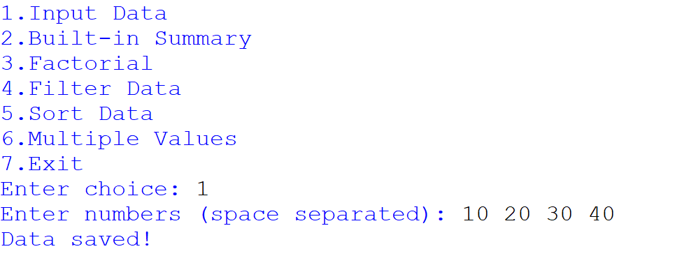

# 📊 Python Data Processing Menu Project

## ✨ Overview

This project is a **menu-driven Python program** that allows users to input, process, and analyze numerical data.

It demonstrates important programming concepts such as:

- Functions 🧩  
- Loops 🔄  
- Recursion 🔁  
- Data filtering 🔍  
- Sorting 📊  
- Returning multiple values 📦  

---

## 🧰 Technologies Used

- 🐍 Python 3  
- ⚙️ Built-in Functions:
  - `min()`
  - `max()`
  - `sum()`
  - `sorted()`

---

## 🎯 Features

✔️ Input numerical data  
✔️ Generate summary statistics  
✔️ Calculate factorial using recursion  
✔️ Filter data based on conditions  
✔️ Sort data (ascending & descending)  
✔️ Return multiple computed values  
✔️ Simple CLI interface  

---

## 📋 Program Menu

Input Data

Built-in Summary

Factorial

Filter Data

Sort Data

Multiple Values

Exit

📸 **Menu Preview**

  

---

## 📥 1. Input Data

Allows the user to enter numbers separated by spaces.

📸 **Example Output**

  

---

## 📈 2. Built-in Summary

Displays:

- Total elements  
- Minimum  
- Maximum  
- Sum  
- Average  

📸 **Example Output**

  

---

## 🔢 3. Factorial (Recursion)

Calculates factorial using recursion.

📸 **Example Output**

  

---

## 🔍 4. Filter Data

Filters values based on a threshold.

📸 **Example Output**

  

---

## ↕️ 5. Sort Data

Displays:

- Ascending order  
- Descending order  

📸 **Example Output**

  

---

## 📦 6. Multiple Values

Returns:

- Minimum  
- Maximum  
- Average  

📸 **Example Output**

  

---

## ❌ 7. Exit Program

Gracefully exits the application.

📸 **Example Output**

  

---

## 📂 Project Structure

## 📂 Project Structure

Python-Data-Processing/
│
├── projects.py
├── README.md
└── Screenshots/
├── sc.1.png
├── sc.2.png
├── sc.3.png
├── sc.4.png
├── sc.5.png
├── sc.6.png
└── sc.7.png

🧠 Concepts Covered

🔄 Loops

⚡ Conditional Statements

🔁 Recursion

🧩 Functions

🔍 Filtering Logic

📊 Data Processing

📦 Returning Multiple Values

👨‍💻 Author

Dhruv Prajapati

